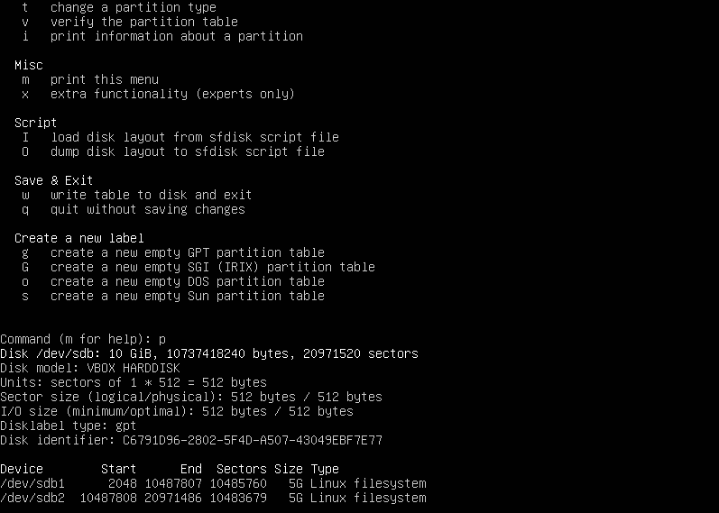
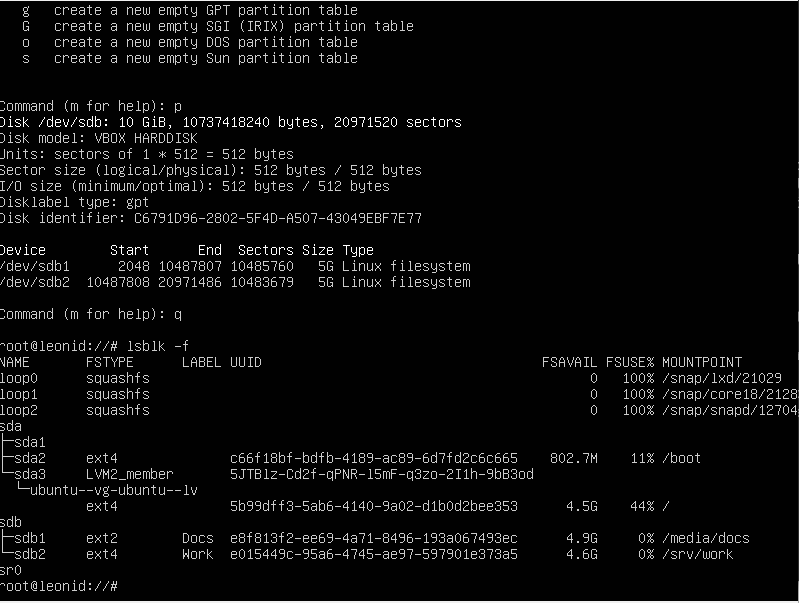
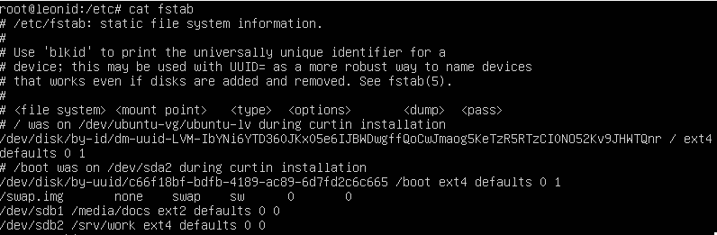
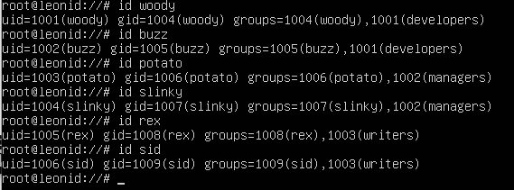
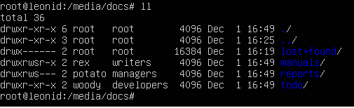
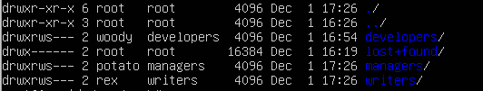
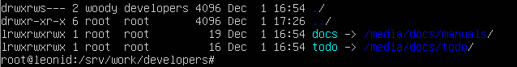

# Форматирование диска #
lsblk -f # определить файл-устройство для диска  
fdisk /dev/sdb # перейти для разметки диска  
Внутри fdisk выполнить   
* g # разметка таблицы разделов в формате GPT  
* n # создать раздел  
* 1 # Номер раздела  
* [Нажать Enter] - принять дефолтное значение начала  
* +5G # установить размер 5G  
* n # создать другой раздел  
* 2 # номер раздела  
* [Нажать Enter] #  принять дефолтное значение начала  
* [Нажать Enter] #  принять дефолтное значение конца  

mkfs.ext2 -L Docs /dev/sdb1 # Отформатировать диск в формате ext2 с флагом Docs  
mkfs.ext4 -L Work /dev/sdb2 # Отформатировать диск в формате ext4 с флагом Work  
tune2fs -m 0 /dev/sdb1 # зарезервировать 0% для root пользователя   
tune2fs -m 5 /dev/sdb2 # зарезервировать 5% для root пользователя  

# монтирование файловой системы #

# Создание пользователей (отключение пороля): # 
adduser woody --disabled-password  
adduser buzz --disabled-password  
adduser potato --disabled-password  
adduser slinky --disabled-password  
adduser rex --disabled-password  
adduser sid --disabled-password  

# Создание групп:(root права) #
addgroup developers  
addgroup managers  
addgroup writers  

# Добавление пользователей в группу: #
usermod -aG developers woody  
usermod -aG developers buzz  
usermod -aG managers potato  
usermod -aG managers slinky  
usermod -aG writers rex  
usermod -aG writers sid  

# Переход в директорию: #
cd /media/docs  
# Создание поддиректорий: #
mkdir manuals  
mkdir reports  
mkdir todo  
# Смена владельца: #
chown rex:writers manuals  
chown potato:managers reports  
chown woody:developers todo  
# Установление прав доступа: #
chmod manuals 775  
chmod manuals g+s  
chmod reports 770  
chmod reports g+s  
chmod todo 755  

# Переход в директорию: #
cd /srv/work  
# Создание поддиректорий: #
mkdir writers  
mkdir managers  
mkdir developers  
# Смена владельца: #
chown rex:writers writers  
chown potato:managers managers  
chown woody:developers developers  
# Установление прав доступа: #
chmod writers 770  
chmod writers g+s  
chmod managers 770  
chmod managers g+s  
chmod developers 770  
chmod developers g+s  

# Создание мягких ссылок: #
cd /srv/work/developers  
ln -s /media/docs/manuals docs  
ln -s /media/docs/todo todo  

